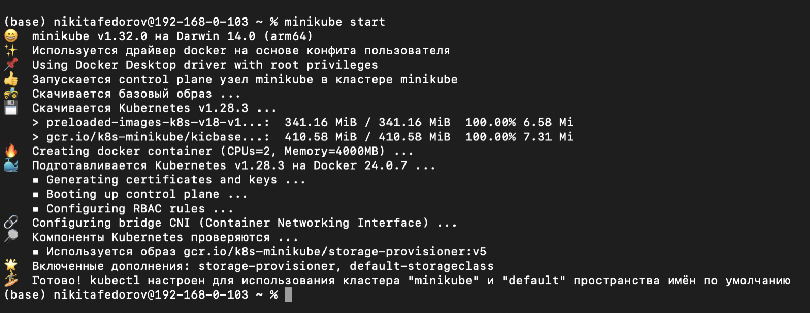
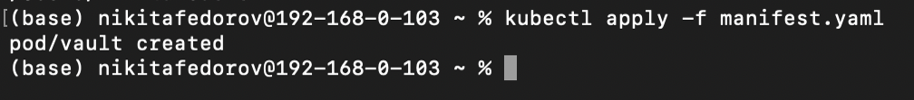
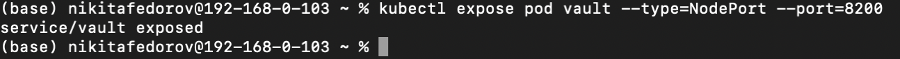
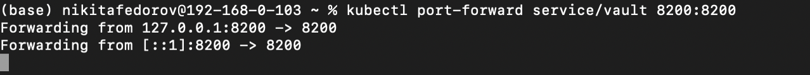
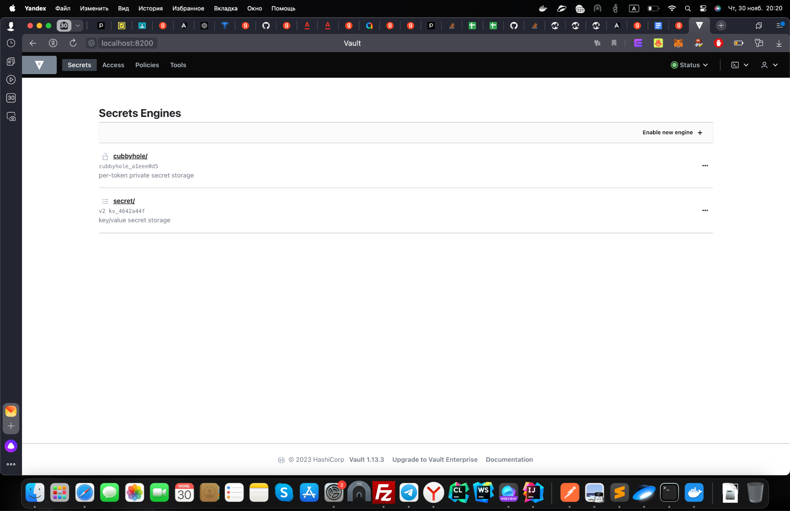
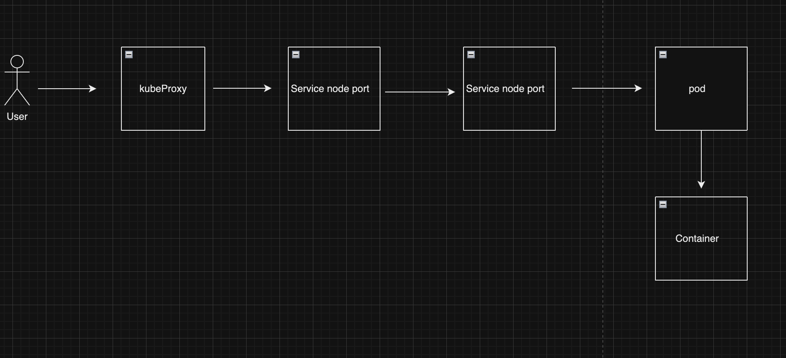

# Установка Docker и Minikube, мой первый манифест

Университет: [ITMO University](https://itmo.ru/ru/)\
Факультет: [FICT](https://fict.itmo.ru)\
Курс: [Введение в распределенные технологии](https://github.com/itmo-ict-faculty/introduction-to-distributed-technologies)\
Год: 2023/2024\
Группа: K4110c\
Автор: Федоров Никита Сергеевич\
Лабораторная работа: Lab1\
Дата создания: 12.12.2023\
Дата завершения: 12.12.2023

## 0. Введение

### Цель работы
Ознакомиться с инструментами `Minikube` и `Docker`, а также развернуть свой первый Pod.

## 1. Запуск Minikube
Для запуска Minikube использована команда `minikube start`:



В результате видно, что Minikube успешно сконфигурирован для использования Docker, а также установлен `kubectl`.

## 2. Запуск сервиса

В директории находится файл `manifest.yaml`, описывающий конфигурацию Pod.

Подробное описание полей в `manifest.yaml`:
- `metadata` содержит информацию для идентификации пода: имя, неймспейс и метки.
- `spec` определяет содержимое пода. В разделе `containers` указан контейнер с именем `vault`, использующий образ [vault:1.13.3](https://hub.docker.com/_/vault/) и пробрасывающий порт 8200.

Создадим под в кластере с помощью команды:
```bash
kubectl apply -f manifest.yaml
```

Вывод команды подтверждает успешное создание пода:


Далее создадим сервис для пода:
```bash
kubectl expose pod vault --type=NodePort --port=8200
```

Сервис успешно создан:


Чтобы получить доступ, выполним проброс портов:
```bash
kubectl port-forward service/vault 8200:8200
```

Проброс портов выполнен:


Теперь можно зайти в под по адресу http://localhost:8200

Страница Vault доступна:


## 3. Получение токена

Root токен находится в логах пода `vault`. Получим его с помощью команды:
```bash
kubectl logs vault | grep "Root Token"
```

## 4. Схема


