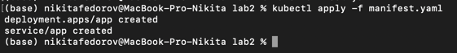
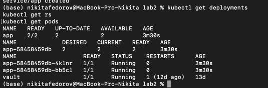
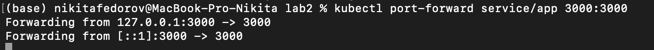
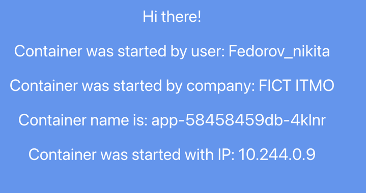
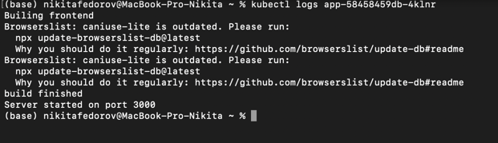
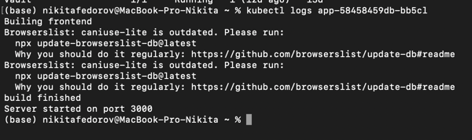
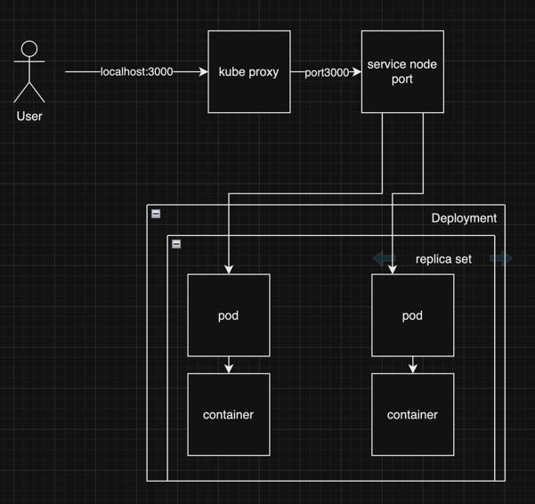

# Развертывание веб-сервиса в Minikube, доступ к веб-интерфейсу сервиса. Мониторинг сервиса

Университет: [ITMO University](https://itmo.ru/ru/)\
Факультет: [FICT](https://fict.itmo.ru)\
Курс: [Введение в распределенные технологии](https://github.com/itmo-ict-faculty/introduction-to-distributed-technologies)\
Год: 2023/2024\
Группа: K4110c\
Автор: Федоров Никита Сергеевич\
Лабораторная работа: Lab2\
Дата создания: 12.12.2023\
Дата завершения: 12.12.2023

## 0. Введение

###  Цель работы
Изучение типов "контроллеров" для развертывания контейнеров, анализ сетевых сервисов и разворачивание собственного веб-приложения.

### Задание
- Создание `deployment` с 2 репликами контейнера [ifilyaninitmo/itdt-contained-frontend:master](https://hub.docker.com/repository/docker/ifilyaninitmo/itdt-contained-frontend) и передача переменных в эти реплики: `REACT_APP_USERNAME`, `REACT_APP_COMPANY_NAME`.

- Создание сервиса, через который можно получить доступ к этим "подам". Выбор типа сервиса остается на усмотрение студента.

- Запуск режима проброса портов в `minikube` и подключение к контейнерам через веб-браузер.

- Проверка переменных `REACT_APP_USERNAME`, `REACT_APP_COMPANY_NAME`, и `Container name` на веб-странице. Меняются ли они? Если да, почему?

- Проверка логов контейнеров, их включение в отчет.

## 1. Ход работы
### 1.1. Создание деплоймента
Конфигурация деплоймента:

```yaml
apiVersion: apps/v1
kind: Deployment
metadata:
  name: app
  labels:
    app: app
spec:
  replicas: 2
  selector:
    matchLabels:
      app: app
  template:
    metadata:
      labels:
        app: app
    spec:
      containers:
      - name: itdt-contained-frontend
        image: ifilyaninitmo/itdt-contained-frontend:master
        ports:
        - containerPort: 3000
          name: http
        env:
          - name: REACT_APP_USERNAME
            value: 'Fedorov_nikita'
          - name: REACT_APP_COMPANY_NAME
            value: 'FICT ITMO'
```

Описание полей в `spec`:
* `replicas` - количество реплик контейнера, которые необходимо создать.
* `selector` - указывает `ReplicaSet`, какими подами она сможет управлять. Необходимо совпадение всех ключей с метками для выбора конкретного пода.
* `template` - описывает шаблон подов, который необходимо создать. Добавлено поле `env` для установки переменных окружения внутри контейнеров.

### 1.2. Создание сервиса
Сервис можно создать командой:

```yaml
apiVersion: v1
kind: Service
metadata:
  name: app
spec:
  type: NodePort
  ports:
    - port: 3000
      protocol: TCP
      name: http
  selector:
    app: app
```

Более интересный способ - описание сервиса в том же манифесте. Такой подход обеспечивает большую гибкость для решения масштабных задач.

### 1.3. Запуск
Запуск всей конфигурации:

```bash
kubectl apply -f manifest.yaml
```


Статус `unchanged` означает, что конфигурация сущности не изменилась с предыдущего запуска.

Проверка созданных сущностей:

```bash
kubectl get deployments
kubectl get rs
kubectl get pods
```

### 1.4. Подключение к контейнерам
Проброс портов и подключение к контейнерам:

```bash
kubectl port-forward service/app 3000:3000
```


### 1.5. Проверка переменных
Значения переменных `REACT_APP_USERNAME`, `REACT_APP_COMPANY_NAME` и `Container name` на веб-странице остаются неизменными от контейнера к контейнеру.

### 1.6. Логи
Просмотр логов пода:

```bash
kubectl logs app-58458459db-4klnr
```

Логи для другого пода идентичны.

## 2. Схема
