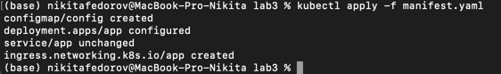

# Сертификаты и "секреты" в Minikube: Безопасное хранение данных

**Университет:** [ИТМО](https://itmo.ru/ru/)  
**Факультет:** [ФИКТ](https://fict.itmo.ru)  
**Курс:** [Введение в распределенные технологии](https://github.com/itmo-ict-faculty/introduction-to-distributed-technologies)  
**Год:** 2023/2024  
**Группа:** K4110c  
**Автор:** Федоров Никита Сергеевич  
**Лабораторная работа:** Lab3  
**Дата создания:** 12.12.2023  
**Дата завершения:** 12.12.2023

## 0. Введение

### Цель работы
Ознакомиться с сертификатами и "секретами" в Minikube, освоить правила безопасного хранения данных в Minikube.

### Задание
- Создать `configMap` с переменными: `REACT_APP_USERNAME`, `REACT_APP_COMPANY_NAME`.
- Создать `replicaSet` с двумя репликами контейнера [ifilyaninitmo/itdt-contained-frontend:master](https://hub.docker.com/repository/docker/ifilyaninitmo/itdt-contained-frontend) и передать переменные в эти реплики: `REACT_APP_USERNAME`, `REACT_APP_COMPANY_NAME` через этот `configMap`.
- Включить `minikube addons enable ingress`, сгенерировать TLS сертификат и импортировать его в Minikube.
- Создать Ingress в Minikube, указав ранее импортированный сертификат, FQDN, по которому будем заходить, а также имя ранее созданного сервиса.
- Добавить FQDN и IP-адрес Ingress в `hosts`, попробовать получить доступ через браузер.
- Войти в приложение через FQDN по HTTPS и проверить наличие сертификата.

## 1. Ход работы
### 1.1. Что необходимо

Для выполнения задачи нужно описать несколько сущностей Kubernetes:
* `ConfigMap`, через который будут передаваться необходимые переменные.
* `Deployment`, который будет использоваться вместо `ReplicaSet`.
* `Service`
* `Ingress` — сущность, обрабатывающая внешние запросы к кластеру. Можно указать, какие запросы должны обрабатываться (например, имена, пути, порты и т. д.).

Также нужно создать сертификат. Можно описать его в манифесте, что не совсем хорошо для безопасности в продакшен-приложениях (сертификат легко выставить), но также можно добавить его через командную строку. Конечно, существуют более современные и безопасные методы, но эта задача не о них.

### 1.2. Описание манифеста

Давайте опишем `configMap`:
```yaml
apiVersion: v1
data:
  REACT_APP_USERNAME: "zhukoff-pavel"
  REACT_APP_COMPANY_NAME: "ITMO"
kind: ConfigMap
metadata:
  creationTimestamp: null
  name: config
```

В целом, развертывание и сервис можно использовать из второй лабораторной работы; они практически не изменятся. Единственное, что изменится — это раздел в сервисе: `env` будет заменено на `envFrom` с указанием имени `configMap`:

<table>
<tbody>
<tr>
<td> Было </td>
<td> Стало </td>
</tr>
<tr>
<td>

```yaml
env:
    - name: REACT_APP_USERNAME
    value: 'zhukoff-pavel'
    - name: REACT_APP_COMPANY_NAME
    value: 'FICT ITMO'
```

</td>
<td>

```yaml
envFrom:
    - configMapRef:
        name: config
```

</td>
</tr>
	</tbody>
</table>

Теперь опишем `Ingress`:
```yaml
apiVersion: networking.k8s.io/v1
kind: Ingress
metadata:
  name: app
spec:
  tls:
    - hosts:
        - test-k8s-lab.app
      secretName: app-tls
  rules:
    - host: test-k

8s-lab.app
      http:
        paths:
          - path: /
            pathType: Prefix
            backend:
              service:
                name: app
                port:
                  name: http
```

Пояснение полей:
* `tls` указывает, какие секреты использовать (поле `secretName` берется из отдельно созданного секрета) для указанных `hosts`.
* `rules` указывают правила обработки различных запросов.
  * `PathType: Prefix` вместе с `path: /` означает, что под это правило попадают _все_ пути, которые мы можем использовать для доступа к этому приложению, например, `test-k8s-lab.app/foo/bar` или просто `test-k8s-lab.app`.
  * Поле `backend` позволяет указать, на какой конкретно сервис направить такой запрос.

### 1.3. Запуск Minikube

Запускайте `Minikube` как обычно, но теперь нужно добавить аддон `ingress`.


### 1.4. Создание сертификата

Теперь создадим сертификат. Для этого воспользуемся `openssl` с помощью следующей команды:

```bash
$ openssl req -new -newkey rsa:4096 -x509 -sha256 -days 365 -nodes -out selfsigned.crt -keyout selfsigned.key
```

Пояснение команды:
* `-new` указывает, что нам нужен новый сертификат.
* `-newkey rsa:4096` указывает, что у нас будет ключ длиной 4096 бит.
* `-x509` означает, что мы создаем сертификат в соответствии со стандартом X.509.
* `-sha256` генерирует сертификат с использованием хэш-суммы sha256.
* `-days 365` указывает, что срок действия этого сертификата — 365 дней.
* `-nodes` позволяет не шифровать приватный ключ парольной фразой.
* `-out file.crt` описывает, куда будет помещен полученный сертификат.
* `-keyout file.key` описывает, куда будет помещен полученный ключ.


Теперь добавим этот сертификат в наш Minikube:


### 1.5. Подготовка кластера

Теперь можно применять конфигурации из манифеста.



Добавим FQDN нашего хоста в `/etc/hosts`:


### 1.6. В браузер!

Запустим `minikube tunnel`:


И теперь можно открыть браузер:


### 1.7. Схема

