# Сети связи в Minikube: CNI и CoreDNS

**Университет:** [ИТМО](https://itmo.ru/ru/)  
**Факультет:** [ФИКТ](https://fict.itmo.ru)  
**Курс:** [Введение в распределенные технологии](https://github.com/itmo-ict-faculty/introduction-to-distributed-technologies)  
**Год:** 2023/2024  
**Группа:** K4110c  
**Автор:** Федоров Никита Сергеевич  
**Лабораторная работа:** Lab4  
**Дата создания:** 12.12.2023  
**Дата завершения:** 12.12.2023

## 0. Введение

###  Цель работы
Ознакомиться с CNI Calico и функцией `IPAM Plugin`, изучить особенности работы CNI и CoreDNS.

### Задание
- Запустить Minikube с плагином `CNI=calico` и режимом работы `Multi-Node Clusters` одновременно, развернуть 2 ноды.
- Проверить работу CNI плагина Calico и количество нод.
- Указать `label` по признаку стойки или географического расположения (на свое усмотрение).
- Разработать манифест для Calico, который на основе указанных меток назначает IP-адреса подам исходя из пулов IP-адресов в манифесте.
- Создать деплоймент с двумя репликами контейнера [ifilyaninitmo/itdt-contained-frontend:master](https://hub.docker.com/repository/docker/ifilyaninitmo/itdt-contained-frontend) и передать переменные в эти реплики: `REACT_APP_USERNAME`, `REACT_APP_COMPANY_NAME`.
- Создать сервис, через который будет доступ в поды.
- Запустить в Minikube режим проброса портов и подключиться к контейнерам через веб-браузер.
- Проверить переменные `Container name` и `Container IP`. Если меняются, объяснить почему.
- Зайти в любой под и попробовать пинговать поды, используя FQDN соседнего пода.

## 1. Ход работы
### 1.1. Запуск Minikube
В данной лабораторной работе Minikube запускается с использованием следующей команды:
```bash
minikube start --network-plugin=cni --cni=calico --nodes 2
```
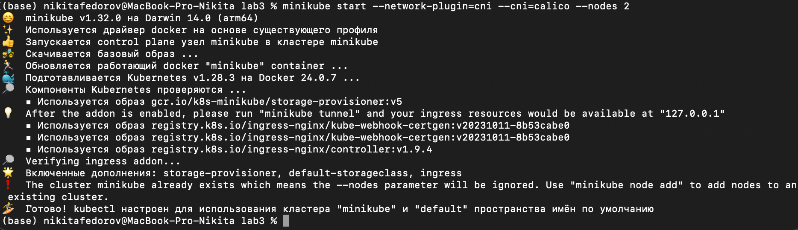

### 1.2. Проверка числа нод
После успешного запуска проверим, что созданы действительно две ноды с помощью команды:
```bash
kubectl get nodes
```
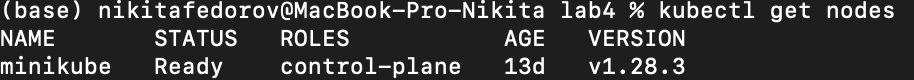
Также проверим количество подов Calico. Их число должно соответствовать количеству нод:
```bash
kubectl get pods -l k8s-app=calico-node -A
```

### 1.3. Пометка нод
Каждую ноду пометим по признаку стойки, в данном случае, используя метку "rack". Пометка выполняется следующей командой:
```bash
kubectl label nodes <node-name> rack=<rack-id>
```
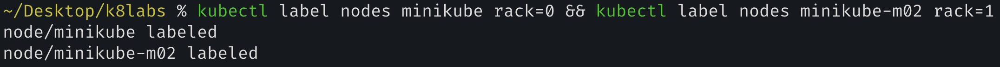

Можно убедиться, что ноды получили свои метки, например, с помощью команды:
```bash
kubectl get nodes -l rack=0
```
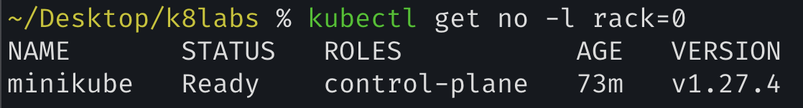

### 1.4. Создание Calico-манифеста
Был разработан следующий манифест Проанализируем его:

```yaml
apiVersion: projectcalico.org/v3
kind: IPPool
metadata:
  name: rack-0-ippool
spec:
  cidr: 192.168.10.0/24
  ipipMode: Always
  natOutgoing: true
  nodeSelector: rack == "0"
```

В данном манифесте используются следующие поля:
- `cidr` определяет диапазон IP-адресов, доступных для данного IPPool. В данном случае используется диапазон `192.168.10.0/24` (256 адресов).
- `ipipMode` позволяет настроить режим IP-туннелирования. Режим `Always` включает инкапсуляцию пакетов для всего трафика от Calico-хоста к другим Calico-контейнерам и VM, имеющим IP в заданном IPPool.
- `natOutgoing` разрешает подам ходить во внешнюю сеть с использованием NAT. В данной работе эта настройка несущественна, так как не требуется выход во внешний интер

нет, и поды не развернуты на реальных устройствах.
- `nodeSelector` определяет, какие ноды будут получать IP из этого пула. В данном случае выбираются все ноды, имеющие метку "rack=0".

Перед созданием IPPool "default-ipv4-ippool" удалим стандартный через `calicoctl delete ippools default-ipv4-ippool`:
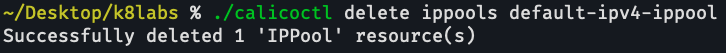

Применим созданный манифест:
```bash
./calicoctl create -f -< calico.yml
```
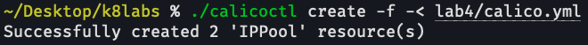

Проверим наличие IPPool:
```bash
./calicoctl get ippools
```
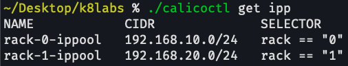

### 1.5. Создание деплоймента
Манифест с сервисом, деплойментом и конфигмапой можно переиспользовать из третьей лабораторной работы (изменен только тип сервиса на `LoadBalancer` для возможности использования `minikube tunnel` и доступа к разным контейнерам):
```bash
kubectl apply -f manifest.yaml
```
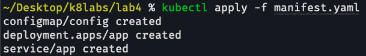

Теперь убедимся, что поды размещены на разных нодах, и при этом они получили IP из указанного нами пула:
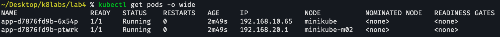

### 1.6. Вход в поды
Запустим режим проброса портов с помощью команды:
```bash
minikube tunnel
```
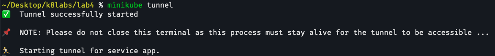

Теперь мы можем подключиться к разным контейнерам через веб-браузер:


Видно, что разные контейнеры имеют разные IP, назначенные из соответствующих IPPool'ов.

### Почему меняются Container name и Container IP?
Эти переменные меняются, потому что они задаются для каждого контейнера отдельно, и LoadBalancer решает, на какой контейнер перенаправить.

### 1.7. Ping соседа
Прежде чем пинговать под, найдем его FQDN с использованием `nslookup`. Зайдем в под `app-d7876fd9b-6x54p` и узнаем имя соседнего пода:
```bash
kubectl exec app-d7876fd9b-6x54p -- nslookup 192.168.20.1
```
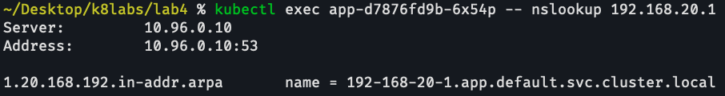

Теперь, используя FQDN `192-168-20-1.app.default.svc.cluster.local`, мы можем пинговать под:
```bash
kubectl exec app-d7876fd9b-6x54p -- ping 192-168-20-1.app.default.svc.cluster.local
```
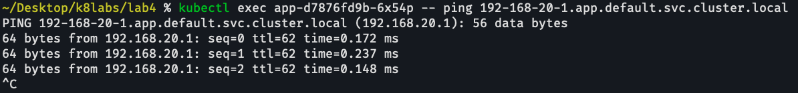

Видно, что пакеты успешно достигают назначения и возвращаются обратно.

### 2. Схема
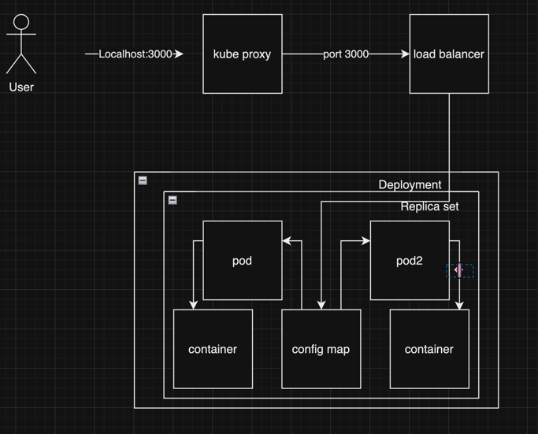